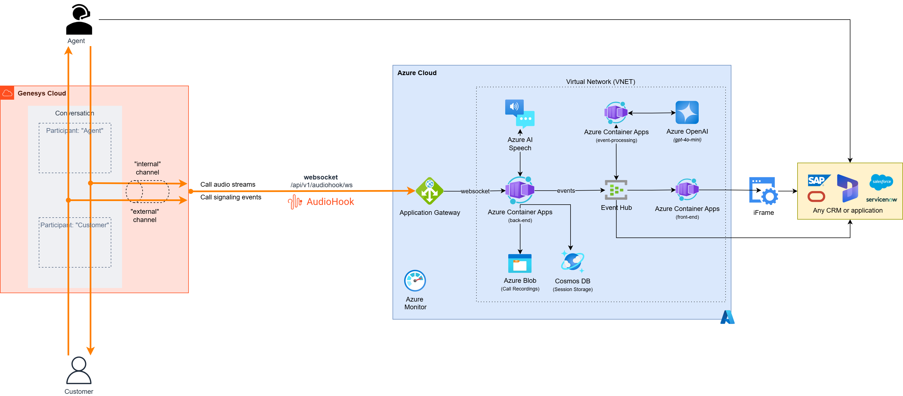

# Sample: Genesys AudioHook to Azure

This project provides a reference implementation of a WebSocket server on Azure that integrates with the [Genesys AudioHook protocol](https://developer.genesys.cloud/devapps/audiohook) for real-time transcription. It implements the [AudioHook Monitor](https://help.mypurecloud.com/articles/audiohook-monitor-overview/), where audio is streamed from the client to the server, and the server does not return results to the client.

With this AudioHook server, you can connect your own speech processing pipeline—including custom speech-to-text or generative audio models—while maintaining data security and enabling seamless integration with other cloud-native applications.

Real-time transcription enables advanced call center analytics, such as live summarization, agent coaching, and instant question answering, to improve customer experience and operational efficiency.

## Components

The AudioHook processing is separated from AI services, allowing flexible deployment, strong security, and straightforward integration with enterprise systems. Its modular architecture supports horizontal scaling and rapid customization of the AI pipeline to meet evolving contact center requirements.

- [AudioHook WebSocket server (Python)](./server/python)
- Real-time AI processing service (Python, Semantic Kernel) (_coming soon_)
- Demo front-end (JavaScript, React) with back-end (Python) (_coming soon_)

### Architecture



## Deployment

Deploy this accelerator using the provided [infrastructure-as-code (Bicep)](./infra) templates. The recommended method is the [Azure Developer CLI (azd)](https://learn.microsoft.com/en-us/azure/developer/azure-developer-cli/), which simplifies authentication, resource provisioning, and configuration.

1. Authenticate with Azure by running:

    ```bash
    azd auth login
    ```

    This opens a browser window for secure sign-in.

2. Deploy resources with:

    ```bash
    azd up
    ```

3. During deployment, you’ll be prompted for:

    | Parameter           | Description                                                                 |
    |---------------------|-----------------------------------------------------------------------------|
    | Azure Subscription  | The Azure subscription for resource deployment.                              |
    | Azure Location      | The Azure region for resources (e.g., swedencentral).                       |
    | Environment Name    | A unique environment name (used as a prefix for resource names).             |

    > **Note:** For best compatibility, use `swedencentral` as your Azure region. Other regions may not be fully supported or tested.

4. After deployment, the CLI will display a link to your web service. Open it in your browser—you should see `{"status": "healthy"}` to confirm the service is running.

## Genesys configuration

Once your web service is running, configure the AudioHook Monitor in Genesys Cloud to stream audio to your Azure deployment.

1. Follow the [Genesys configuration guide](https://help.mypurecloud.com/articles/configure-and-activate-audiohook-monitor-in-genesys-cloud/).

2. Use the Connection URI output after deployment, or take the web service URL from step 4, replace `https` with `wss`, and append `/audiohook/ws` as the path.

3. Click the credentials tab, here you will need to provide the API Key and Client Secret. Navigate to the Azure Portal and your new resource group, and navigate to the Key Vault. Navigate to Objects -> Secrets. Here you will find the API Key and Client Secret.

These values are auto generated during deployment, but it is a best practice to change them to your own values. Make sure the Client Secret is a BASE64 encoded string.

> note: If you don't have access to the keys, navigate to Access control (IAM) and assign your account the Key Vault Secrets Officer role.
